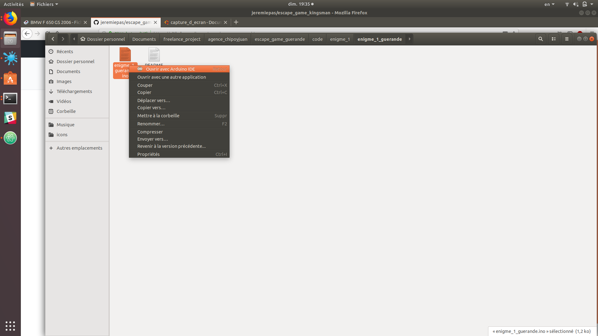
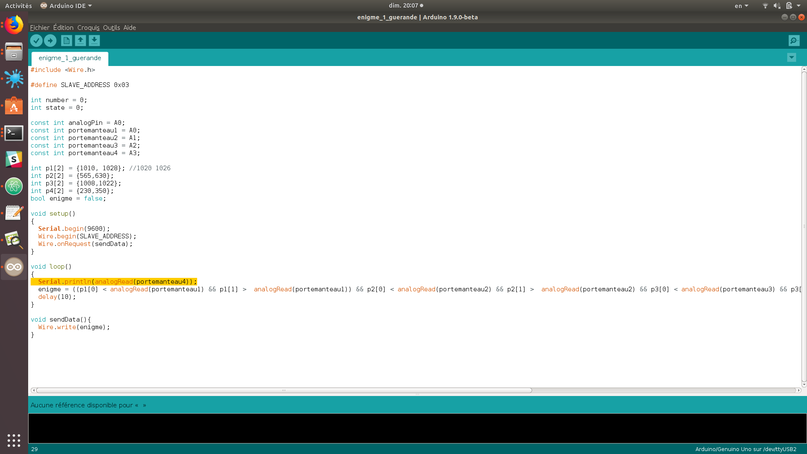
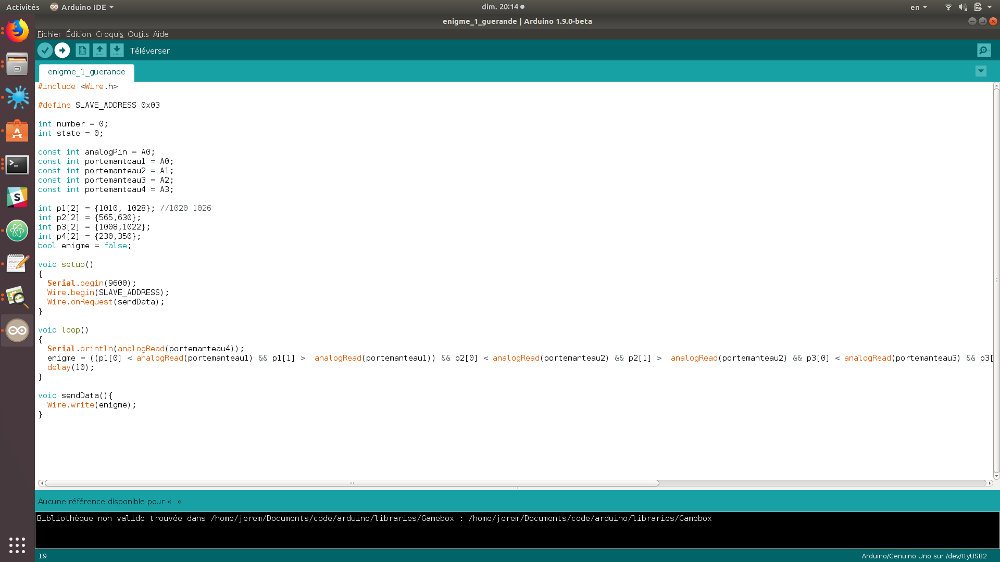
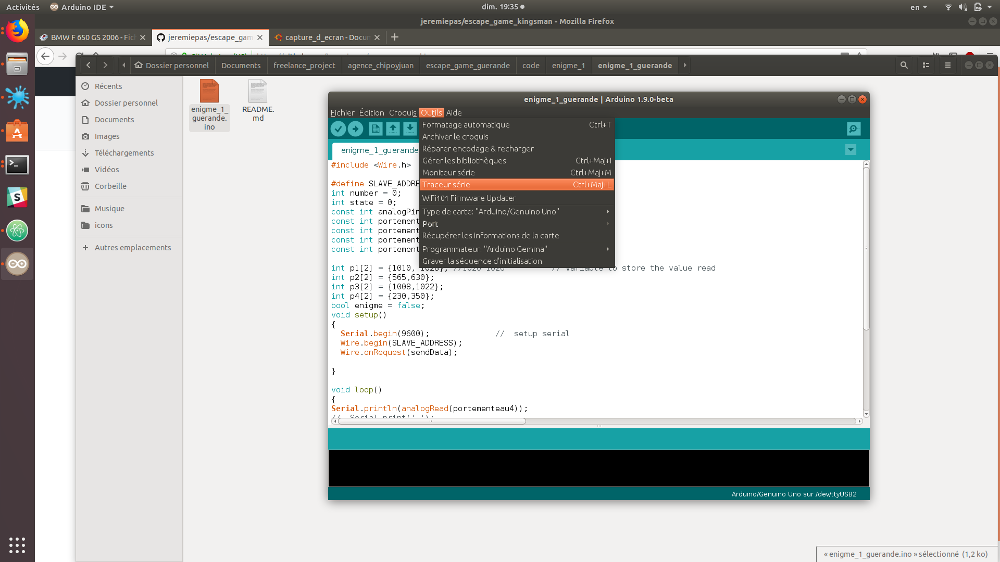

# escape game guerande
## enigme 1 porte menteau

pression différente sur 4 porte manteau ouvre une trappe.

### branchement
* branchement capteur

```
 A0 = porte menteaux un ecoute
 A1 = porte menteaux deux ecoute
 A2 = porte menteaux trois ecoute
 A3 = porte menteaux quatre ecoute
```
* communication

```
A4 = sda connexion
A5 = scl connexion
```

####  définir les valeurs des capteur

  les variables contenant les valeur sont :
    p1, p2, p3, p4
  elle corresponde a chaque porte manteau.


  pour définir les valeurs de ces variable il faut utilise l’éditeur Arduino.

  1. ouvrir le fichier __code/enigme_1/enigme_1_guerande/enigme_1_guerande.ino__ avec l’éditeur Arduino.

      

  2. modifie la ligne ```Serial.println(analogRead(portementeau4));``` et remplace le chiffre 4 par la valeur du porte mentaux voulu.

      

  3. Téléverser le code modifie sur la carte en cliquant en haut a gauche sur la flèche.

      * choisir le bon port et le bon type de carte  

      

  4. ouvrir le __traceur série__ en cliquant sur __outils__ puis __traceur série__.

      
